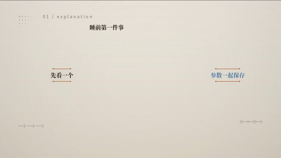
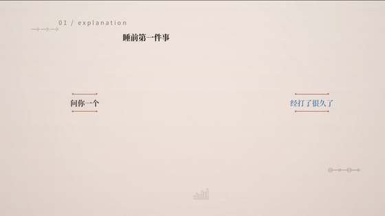
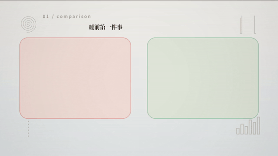
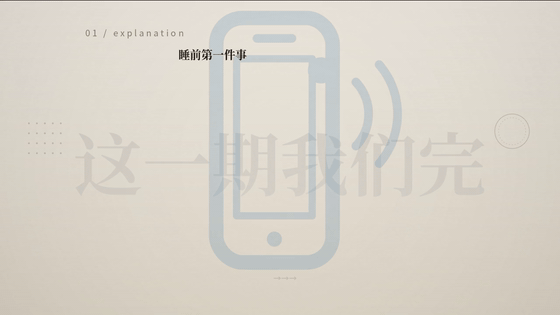

# SRT Media Director

> 把 SRT 字幕变成有导演思维的信息图动画：不是「字幕 → PPT」，
> 而是「语言理解 → 视觉命题 → 强调与编码 → 构图 → 时序编排 → 可验证渲染」。

[](https://github.com/sangbiaolaoda-arch/srt-media-director/actions/workflows/ci.yml)
[](LICENSE)
[](https://www.python.org)

## 一句话

给 Agent 一段 SRT，它输出：`beat-plan → visual-plan → visual-dsl →
render-plan → entrance-plan → film/index.html（可播放）→
validation-report（机器证据）`——每一层落盘、每一层可校验、
每一层错误都有明确的修复路由。

## 真实样例库（先看画面，再谈方法）

「反 PPT / 画面会讲故事」是本项目最大的卖点，所以它必须可被外人验证——
不是只放最好的一段，而是**覆盖不同内容类型 + 主动公开失败案例**。
全部样例在 [`examples/showcase/`](examples/showcase/)：

| 样例 | 内容类型 | 时长 | 看点 |
|---|---|---|---|
| [01-explanatory-tech](examples/showcase/01-explanatory-tech/) | 技术讲解 | 1m11s | 因果链 / 流程排序；中英混排（gradient checkpointing、BF16） |
| [02-narrative-emotion](examples/showcase/02-narrative-emotion/) | 叙事抒情 | 1m54s | 问答断句、让步转折、跨拍交接 |
| [03-data-comparison](examples/showcase/03-data-comparison/) | 数据对比 | 1m00s | 数字/前后变化；语义色分离（正负对比） |
| [04-longform-3min](examples/showcase/04-longform-3min/) | 长片 | 3m41s | 模板复用率、调色板分布是否漂移 |

> 下方 GIF 为各成片前 6 秒的降采样预览（工程内可离线复现完整 MP4）。

**01 · 技术讲解（因果链 / 中英混排）**



**02 · 叙事抒情（问答 / 让步 / 转折）**



**03 · 数据对比（数字 / 前后变化）**



**04 · 长片（3m41s，模板复用与调色板分布）**



复现：
```bash
python runtime/render_video.py \
  --srt examples/showcase/01-explanatory-tech/case.srt \
  --out out/01-tech.mp4
```

**已知失败案例与局限**：[`examples/known-failures/`](examples/known-failures/)
——包括 SRT 解析敏感性（F01）、同质内容不被误判（F02）、曾存在的跨进程
不可复现（F03，已修复 + 回归测试）、缺失的 CJK 排版门禁（F04）、构图模板
覆盖缺口（F05）。**公开失败比只展示高光更可信。**

## 快速开始

```bash
pip install pillow jsonschema cairosvg
python runtime/self_test.py        # Bootstrap Gate：12 道门禁
python cli.py examples/minimal/attention.srt \
  --out sample --overrides examples/minimal/director_overrides.json
```

打开 `sample/film/index.html` 即可播放；`sample/sheet.jpg` 是全部拍的
联系表拼图；`sample/work/` 里是所有中间层 JSON。

调试画面时走样例优先工作流（不要直接渲全片）：

```bash
python runtime/make_sample.py 30              # 前 30 秒全流程 + 拼图
python runtime/make_sample.py 30 --no-render  # 只编译 + 门禁（2 秒级）
```

## 这套方法论解决什么

| 常见做法 | 本项目的替代 |
|---|---|
| 字幕逐句放大 | 每拍一句 Visual Claim，遮住字幕画面仍能传达命题 |
| 素材驱动（有什么贴什么） | 命题驱动：先决定表达什么，再决定素材形态（DSL 是 asset-blind 的） |
| 元素按代码顺序 fade in | 每元素生命周期（enter/exit/after 依赖）+ cue 波次编排：同 cue 真同时、拍尾干净（G5）、跨拍溶解交接 |
| 生成整片再祈祷 | 样例优先（30s）+ 分层验证（L1 机器一致性 / L2 布局门禁 / L3 光栅探针 / L4 人工审美） |
| 编一个 API 让流程继续 | CORE-14：能力缺失只有「等价实现 / 简化 / 阻断报告」三条路 |

## 文档结构（Agent 用法）

- **统筹技能包**：[`skills/coordinator.md`](skills/coordinator.md)——
  Agent 先读它，按阶段调用表加载单个模块，避免上下文过载。
- **模块技能**：[`skills/`](skills/README.md) 下 11 个主题文档，
  规则带唯一编号（`CORE-nn` / `GATE-R8` …），修复日志按编号引用。
- **参考 Runtime**：[`runtime/`](runtime/)——Pillow 单依赖，
  `self_test.py` 是可执行的规格说明。
- **契约 Schema**：[`schemas/`](schemas/)——6 个中间产物的
  JSON Schema，validator 逐层校验。

## 设计哲学（六条）

1. 内容驱动，而不是素材驱动。
2. 关系优先，而不是元素数量优先。
3. 层级优先，而不是平均分布（每拍恰好一个 primary）。
4. 状态变化优先，而不是动作数量优先（Fade In 不算动画）。
5. 连续性优先于特效（先回答「为什么 A 变成 B」）。
6. 可验证优先于「感觉正确」（机器查错误，人查审美，互不替代）。

## 范围与边界（诚实声明）

- 参考 Runtime 是**最小可运行实现**：6 套构图模板、**24 种非拟人 SVG 主体
  画法 + 16 种装饰附体画法**（`runtime/svg_art.py`，合计 41 种矢量画法）、
  5 套情绪背景调色板、1 种镜头运动。它是「经过验证的基线」，不是功能全集
  ——扩展方式见 `CONTRIBUTING.md`。
- 每拍至少 3 个图形/图表/文字要素；装饰在规则内受控随机（种子 =
  `md5(beat_id + 字幕)`，跨机器可复现），并带 4 拍冷却去重。
- 当前适配器输出**自包含 HTML5 Canvas 播放器**；接入 HyperFrames /
  Remotion 等渲染器时，保留 `skills/` 方法论与中间产物契约即可
  （中间语言与执行器解耦是设计目标）。
- MP4 导出为可选能力：`pip install imageio-ffmpeg`（自带静态 ffmpeg）后
  运行 `python runtime/render_video.py --out out/sample.mp4`；无此依赖时
  样例产物为 PNG 探针帧 + HTML 播放器。
- L4（语义/审美）验证**无法自动化**，`validation-report.json` 中恒为
  PENDING——请真的去看 `preview/` 里的帧。

## 质量门禁与可复现性

本项目把「可验证优先」落到机器可查的指标上，而不是口号：

- **重复感门禁（REP）**：把「画面重复 / 没随机感」变成五个可计算量——
  同一模板连续拍数、模板分布熵、相邻拍相似度（模板/区域/调色板/装饰
  加权和）、调色板占比、装饰复现间隔。阈值分 WARN / FAIL，FAIL 让 L2
  整体不通过。见 [`runtime/rep_metrics.py`](runtime/rep_metrics.py)。
- **黄金回归（golden）**：固定 SRT → 五层中间产物（beat-plan / visual-plan
  / visual-dsl / render-plan / entrance-plan）**归一化后哈希比对**。
  「种子跨机器可复现」的声明由 [`tests/`](tests/) 回归测试支撑——它上线
  第一天就抓到并固化了 `PYTHONHASHSEED` 导致的跨进程漂移（见
  [`known-failures/F03`](examples/known-failures/)）。
- **终端渲染兜底**：`runtime/svg_backend.py` 主用 cairosvg、备选 resvg、
  缺失时明确降级而非静默伪装；CI 的 `svg-fallback` job 专门验证「无系统
  cairo 时优雅降级」。

```bash
python runtime/self_test.py     # 12 道 Bootstrap Gate
python -m pytest tests -q       # 黄金哈希回归
python runtime/svg_backend.py --probe   # SVG 后端可用性
```

## 参与贡献

见 [`CONTRIBUTING.md`](CONTRIBUTING.md)。核心约定：**新增 [强制] 级规则
必须附带机器检查**（self_test 或 validator），没有牙齿的规则不进主干。

## License

[MIT](LICENSE) © SRT Media Director contributors
